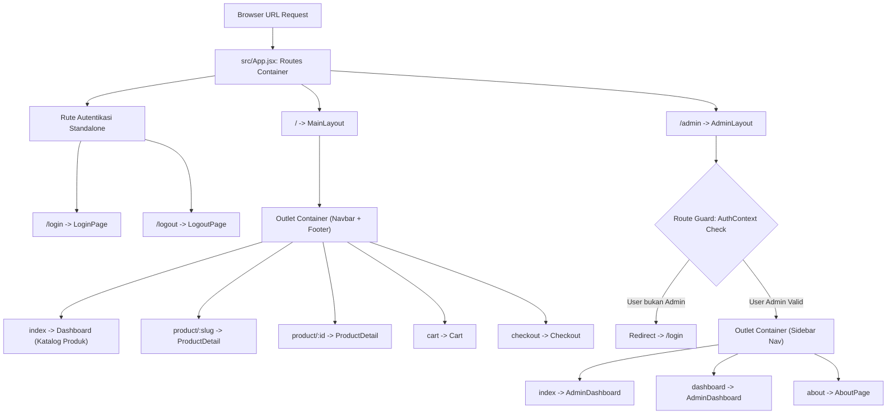
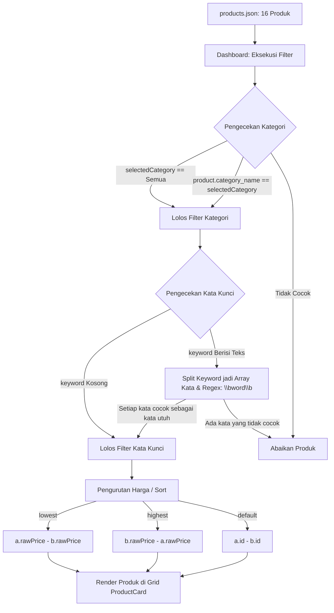
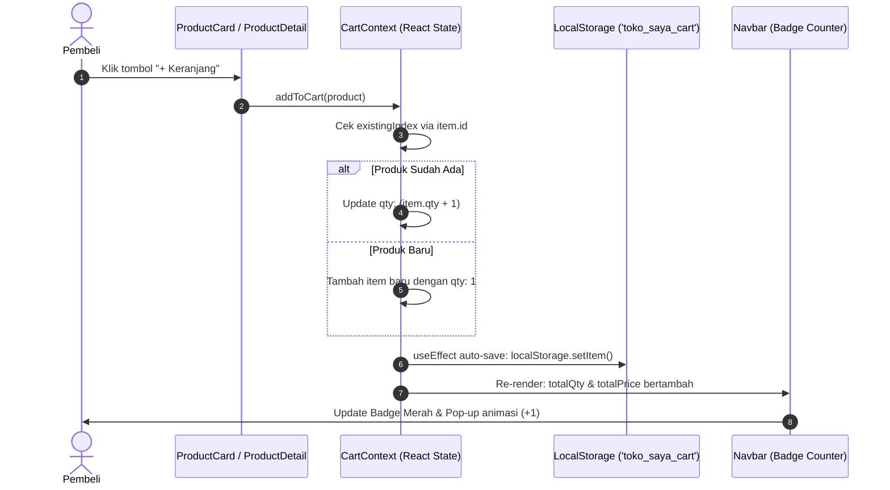
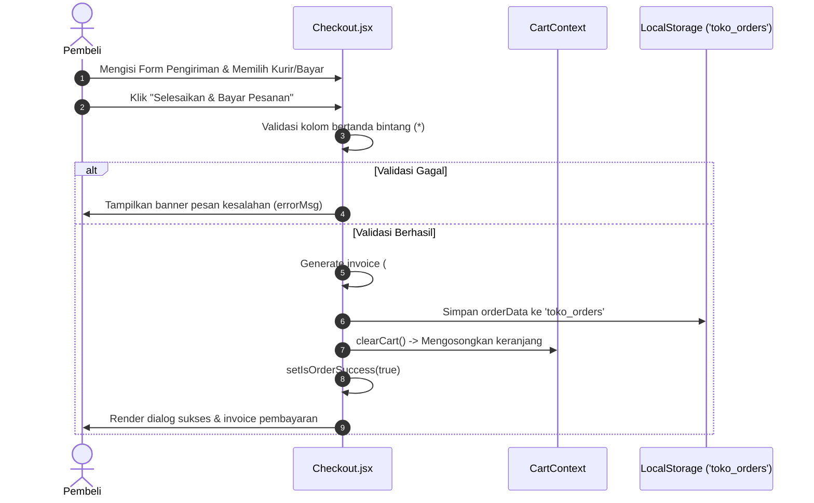
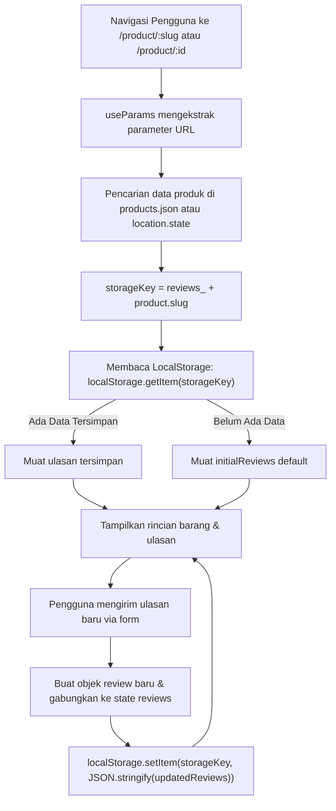
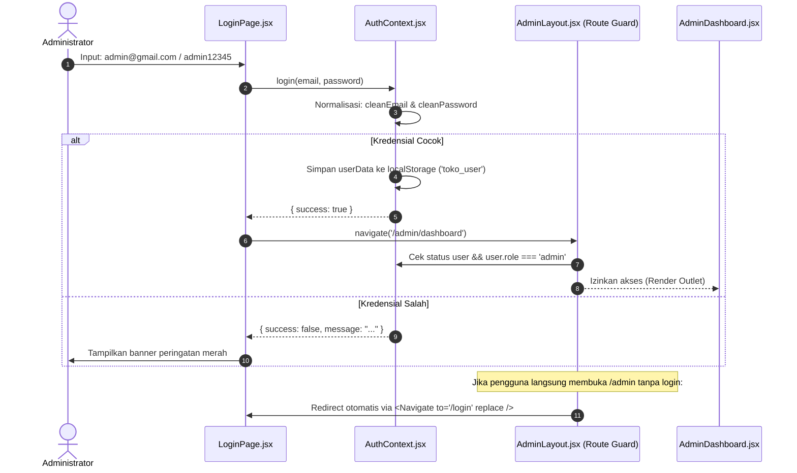

# Audit Arsitektur & Dokumentasi Teknis TokoSaya
**Framework & Teknologi**: React 19 + Vite 8 + Tailwind CSS v4 + React Router v7  
**Tipe Aplikasi**: *Single-Page Application* (SPA) E-Commerce & Dashboard Manajemen  
**Penyusun Dokumentasi**: Antigravity AI Code Assistant  
**Tanggal Audit**: 8 Oktober 2026  

---

## Daftar Isi
1. [Peta Pohon Direktori (File Tree)](#1-peta-pohon-direktori-file-tree)
2. [Ringkasan Arsitektur & Pola Navigasi (Routing & Layouts)](#2-ringkasan-arsitektur--pola-navigasi-routing--layouts)
3. [Bedah Detail Setiap Berkas (File-by-File Breakdown)](#3-bedah-detail-setiap-berkas-file-by-file-breakdown)
   - [Konfigurasi & Entry Points](#konfigurasi--entry-points)
   - [Lapisan Penyedia Global (Context/Utils)](#lapisan-penyedia-global-contextutils)
   - [Lapisan Tata Letak (Layouts)](#lapisan-tata-letak-layouts)
   - [Lapisan Komponen Antarmuka (Components)](#lapisan-komponen-antarmuka-components)
   - [Lapisan Halaman Publik (Pages - Frontpages)](#lapisan-halaman-publik-pages---frontpages)
   - [Lapisan Halaman Admin (Pages - Adminpages)](#lapisan-halaman-admin-pages---adminpages)
   - [Lapisan Halaman Autentikasi (Auth Pages)](#lapisan-halaman-autentikasi-auth-pages)
   - [Lapisan Sumber Data Statis (Data)](#lapisan-sumber-data-statis-data)
4. [Alur Kerja Fitur-Fitur Kunci (Feature Workflow)](#4-alur-kerja-fitur-fitur-kunci-feature-workflow)
   - [a. Katalog Produk, Pencarian Kata Utuh, & Filter](#a-katalog-produk-filter-kategori--pencarian-kata-utuh-word-matching)
   - [b. Manajemen Keranjang Belanja & Persistensi LocalStorage](#b-manajemen-keranjang-cart-state--localstorage)
   - [c. Alur Checkout Sederhana & Rekapitulasi Transaksi](#c-checkout-sederhana--pengarsipan-order)
   - [d. Detail Produk Dinamis & Sistem Ulasan Lokal](#d-detail-produk-dinamis--sistem-review-lokal)
   - [e. Autentikasi Admin Sederhana & Route Guarding](#e-autentikasi-admin-sederhana--route-guarding)
5. [Cheat Sheet Modifikasi Kode (Developer Quick-Reference)](#5-cheat-sheet-modifikasi-kode-developer-quick-reference)

---

# 1. Peta Pohon Direktori (File Tree)

Berikut adalah struktur hierarki berkas pada folder `src/` beserta berkas konfigurasi root proyek:

```text
toko-saya/
├── index.html                   # Entry point dokumen HTML
├── package.json                 # Metadata proyek & daftar dependensi eksternal
├── vite.config.js               # Konfigurasi plugin Vite & Tailwind CSS
└── src/
    ├── main.jsx                 # Entry point JavaScript, mounting React DOM & Root Providers
    ├── App.jsx                  # Konfigurasi perutean sentral (React Router v7)
    ├── App.css                  # Berkas stylesheet opsional (kosong)
    ├── index.css                # Konfigurasi Tailwind v4 & pendaftaran font kustom (@font-face)
    ├── assets/                  # Aset statis lokal
    │   ├── hero.png             # Gambar banner hero (biner)
    │   ├── react.svg            # Ikon React (SVG)
    │   ├── vite.svg             # Ikon Vite (SVG)
    │   └── fonts/               # Tipografi Canva Sans (Regular, Medium, Bold)
    ├── data/
    │   └── products.json        # Database lokal katalog produk (16 item)
    ├── utils/                   # React Contexts & State Management sentral
    │   ├── AuthContext.jsx      # Autentikasi sesi admin & localStorage 'toko_user'
    │   └── CartContext.jsx      # Pengelolaan isi keranjang & localStorage 'toko_saya_cart'
    ├── layouts/                 # Master template tata letak aplikasi
    │   ├── MainLayout.jsx       # Layout antarmuka publik (Navbar + Outlet + Footer)
    │   └── AdminLayout.jsx      # Layout antarmuka back-office (Sidebar + Guard + Outlet)
    ├── components/              # Komponen antarmuka modular yang dapat digunakan kembali
    │   ├── Navbar.jsx           # Navigasi utama etalase publik & badge reaktif keranjang
    │   ├── Sidebar.jsx          # Navigasi panel vertikal admin
    │   ├── ProductCard.jsx      # Kartu informasi produk etalase
    │   ├── ProductFilterBar.jsx # Bilah pencarian (search input) dan dropdown filter
    │   └── MainLayout.jsx       # (Catatan: Berkas duplikat 0-byte, layout aktif ada di src/layouts/)
    └── pages/                   # Komponen halaman (view layer)
        ├── LoginPage.jsx        # Halaman masuk akun admin
        ├── LogoutPage.jsx       # Halaman dialog konfirmasi keluar akun
        ├── frontpages/          # Halaman pembeli (Customer Facing)
        │   ├── Dashboard.jsx    # Katalog etalase utama, filter & sortir harga
        │   ├── ProductDetail.jsx# Rincian deskripsi produk, ulasan, & selector kuantitas
        │   ├── Cart.jsx         # Daftar keranjang belanja, pengubah qty, & modal hapus
        │   └── Checkout.jsx     # Form data pengiriman, opsi kurir/pembayaran, & invoice
        └── adminpages/          # Halaman pengelola (Admin Facing)
            ├── AdminDashboard.jsx # Metrik operasional, ringkasan produk, & status server
            └── AboutPage.jsx    # Informasi spesifikasi teknis dan modul praktikum
```

---

# 2. Ringkasan Arsitektur & Pola Navigasi (Routing & Layouts)

Aplikasi dibangun menggunakan **React Router DOM v7** dengan pola deklaratif berbasis `<Routes>` dan `<Route>`.



### Konsep Nested Routes & Komponen `<Outlet />`
Pola *Nested Routes* (rute bersarang) memecah halaman menjadi dua tingkatan:
1. **Parent Route (Layout Component)**: Bertanggung jawab membungkus struktur berulang seperti navigasi atas (*Header/Navbar*), navigasi samping (*Sidebar*), dan *Footer*.
2. **Child Route (Page Component)**: Bertanggung jawab atas konten spesifik halaman tersebut. Komponen `<Outlet />` bertindak sebagai *placeholder dinamis* tempat React Router menempatkan komponen anak yang rutenya sedang aktif.

#### 1. Cabang Publik: `MainLayout`
- Dipetakan pada path induk: `<Route path="/" element={<MainLayout />}>`.
- Semua rute anak (`/`, `/product/:slug`, `/cart`, `/checkout`) dirender di dalam tag `<main>` di antara `<Navbar />` dan `<footer>`.
- Memberikan pengalaman belanja yang konsisten di mana pembeli tidak kehilangan konteks keranjang belanja dan bilah navigasi saat berpindah halaman.

#### 2. Cabang Pengelola: `AdminLayout`
- Dipetakan pada path induk: `<Route path="/admin" element={<AdminLayout />}>`.
- Dilengkapi dengan *Route Guard* internal berbasis `AuthContext`.
- Memisahkan tata letak desktop 2-kolom (Sidebar di sisi kiri, `<Outlet />` di sisi kanan) serta menyediakan kontrol *Sidebar drawer* untuk tampilan mobile.

---

# 3. Bedah Detail Setiap Berkas (File-by-File Breakdown)

---

## Konfigurasi & Entry Points

### 1. `package.json`
- **Lokasi & Nama File**: `package.json`
- **Tanggung Jawab Utama**: Menyimpan konfigurasi manifest proyek, skrip eksekusi Vite, serta versi pustaka dependensi.
- **State, Hooks, & Props**: Tidak ada (berkas konfigurasi JSON).
- **Keterhubungan Antar-File**: Dibaca oleh Node.js, Vite, npm/pnpm. Menginisialisasi paket `@tailwindcss/vite`, `react`, `react-dom`, dan `react-router-dom`.
- **Snippet Kode Kunci**:
  ```json
  "dependencies": {
    "@tailwindcss/vite": "^4.3.3",
    "react": "^19.2.8",
    "react-dom": "^19.2.8",
    "react-router-dom": "^7.18.4"
  }
  ```

### 2. `vite.config.js`
- **Lokasi & Nama File**: `vite.config.js`
- **Tanggung Jawab Utama**: Mengatur *bundler engine* Vite serta mengintegrasikan plugin `@vitejs/plugin-react` dan Tailwind CSS v4 `@tailwindcss/vite`.
- **State, Hooks, & Props**: Tidak ada.
- **Keterhubungan Antar-File**: Mengontrol proses bundling file di `index.html` dan `src/`.
- **Snippet Kode Kunci**:
  ```javascript
  import react from '@vitejs/plugin-react'
  import { defineConfig } from 'vite'
  import tailwindcss from '@tailwindcss/vite'

  export default defineConfig({
    plugins: [
      react(),
      tailwindcss(),
    ],
  })
  ```

### 3. `index.html`
- **Lokasi & Nama File**: `index.html`
- **Tanggung Jawab Utama**: Fondasi dokumen HTML yang menyediakan elemen root DOM (`<div id="root"></div>`) dan memuat skrip modul `src/main.jsx`.
- **State, Hooks, & Props**: Tidak ada.
- **Keterhubungan Antar-File**: Menautkan `src/main.jsx` ke browser window.
- **Snippet Kode Kunci**:
  ```html
  <body>
    <div id="root"></div>
    <script type="module" src="/src/main.jsx"></script>
  </body>
  ```

### 4. `src/index.css`
- **Lokasi & Nama File**: `src/index.css`
- **Tanggung Jawab Utama**: Titik integrasi Tailwind CSS v4 (`@import "tailwindcss";`), deklarasi `@font-face` untuk font lokal *Canva Sans* (Regular, Medium, Bold), serta pendaftaran variabel tema `--font-sans`.
- **State, Hooks, & Props**: Tidak ada.
- **Keterhubungan Antar-File**: Diimpor oleh `src/main.jsx`, memengaruhi seluruh styling aplikasi.
- **Snippet Kode Kunci**:
  ```css
  @import "tailwindcss";

  @font-face {
      font-family: 'Canva Sans';
      src: url('./assets/fonts/CanvaSans-Regular.otf') format('opentype');
      font-weight: 400;
  }

  @theme {
      --font-sans: 'Canva Sans', sans-serif;
  }

  body {
      font-family: var(--font-sans);
  }
  ```

### 5. `src/main.jsx`
- **Lokasi & Nama File**: `src/main.jsx`
- **Tanggung Jawab Utama**: Inisialisasi React Virtual DOM pada elemen `#root` dan membungkus pohon komponen aplikasi dengan penyedia kontekstual: `<BrowserRouter>`, `<AuthProvider>`, dan `<CartProvider>`.
- **State, Hooks, & Props**: Menerima konfigurasi standar React DOM.
- **Keterhubungan Antar-File**: Mengimpor `index.css`, `App.jsx`, `CartProvider` (`src/utils/CartContext`), dan `AuthProvider` (`src/utils/AuthContext`).
- **Snippet Kode Kunci**:
  ```jsx
  createRoot(document.getElementById('root')).render(
    <StrictMode>
      <BrowserRouter>
        <AuthProvider>
          <CartProvider>
            <App />
          </CartProvider>
        </AuthProvider>
      </BrowserRouter>
    </StrictMode>,
  )
  ```

### 6. `src/App.jsx`
- **Lokasi & Nama File**: `src/App.jsx`
- **Tanggung Jawab Utama**: Hub konfigurasi rute navigasi aplikasi (*routing table*), memetakan setiap URL path ke komponen layout dan halaman yang sesuai.
- **State, Hooks, & Props**: Menggunakan komponen bawaan `react-router-dom`: `<Routes>`, `<Route>`.
- **Keterhubungan Antar-File**: Mengimpor layout `MainLayout`, `AdminLayout` dan semua halaman di `pages/`.
- **Snippet Kode Kunci**:
  ```jsx
  <Routes>
    <Route path="/login" element={<LoginPage />} />
    <Route path="/logout" element={<LogoutPage />} />

    <Route path="/" element={<MainLayout />}>
      <Route index element={<Dashboard />} />
      <Route path="product/:slug" element={<ProductDetail />} />
      <Route path="product/:id" element={<ProductDetail />} />
      <Route path="cart" element={<Cart />} />
      <Route path="checkout" element={<Checkout />} />
    </Route>

    <Route path="/admin" element={<AdminLayout />}>
      <Route index element={<AdminDashboard />} />
      <Route path="dashboard" element={<AdminDashboard />} />
      <Route path="about" element={<AboutPage />} />
    </Route>
  </Routes>
  ```

---

## Lapisan Penyedia Global (Context/Utils)

### 7. `src/utils/AuthContext.jsx`
- **Lokasi & Nama File**: `src/utils/AuthContext.jsx`
- **Tanggung Jawab Utama**: Mengelola status autentikasi sesi administrator, memvalidasi kredensial login secara lokal, serta menyimpan dan menghapus sesi di `localStorage` dengan kunci `toko_user`.
- **State, Hooks, & Props**:
  - `user`: State objek pengguna (atau `null`), diinisialisasi secara malas (*lazy init*) dari `localStorage.getItem("toko_user")`.
  - Menggunakan `useState`, `createContext`, `useContext`.
  - Menerima prop `{ children }` pada `AuthProvider`.
  - Menyediakan custom hook `useAuth()`.
- **Keterhubungan Antar-File**: Digunakan oleh `AdminLayout.jsx` (proteksi rute), `LoginPage.jsx` (eksekusi login), `LogoutPage.jsx` (eksekusi logout), dan `Navbar.jsx` (status tombol masuk/keluar).
- **Snippet Kode Kunci**:
  ```javascript
  const login = (email, password) => {
      const cleanEmail = (email || "").trim().toLowerCase();
      const cleanPassword = (password || "").trim();

      if (cleanEmail === "admin@gmail.com" && cleanPassword === "admin12345") {
          const userData = { email: "admin@gmail.com", role: "admin", name: "Administrator" };
          setUser(userData);
          localStorage.setItem("toko_user", JSON.stringify(userData));
          return { success: true, user: userData };
      }
      return { success: false, message: "Email atau password yang Anda masukkan salah." };
  };

  const logout = () => {
      localStorage.removeItem("toko_user");
      setUser(null);
  };
  ```

### 8. `src/utils/CartContext.jsx`
- **Lokasi & Nama File**: `src/utils/CartContext.jsx`
- **Tanggung Jawab Utama**: Pusat logika bisnis keranjang belanja. Menyediakan daftar item keranjang, fungsi penambahan produk (`addToCart`), perubahan kuantitas (`updateQty`), penghapusan item (`removeFromCart`), pengosongan (`clearCart`), serta perhitungan otomatis total kuantitas (`totalQty`) dan total harga (`totalPrice`). Menjaga sinkronisasi data dengan `localStorage` (`toko_saya_cart`).
- **State, Hooks, & Props**:
  - `cart`: Array item keranjang, diinisialisasi dari `localStorage.getItem("toko_saya_cart")`.
  - Menggunakan `useState`, `useEffect` (untuk autosave ke localStorage saat state `cart` berubah), `createContext`, `useContext`.
  - Menyediakan custom hook `useCart()`.
- **Keterhubungan Antar-File**: Dikonsumsi oleh `Navbar.jsx`, `ProductCard.jsx`, `ProductDetail.jsx`, `Cart.jsx`, dan `Checkout.jsx`.
- **Snippet Kode Kunci**:
  ```javascript
  const addToCart = (product) => {
      setCart((prevCart) => {
          const existingIndex = prevCart.findIndex((item) => item.id === product.id);
          if (existingIndex > -1) {
              const updated = [...prevCart];
              updated[existingIndex] = {
                  ...updated[existingIndex],
                  qty: (updated[existingIndex].qty || 1) + 1,
              };
              return updated;
          } else {
              return [
                  ...prevCart,
                  {
                      id: product.id,
                      name: product.name,
                      slug: product.slug,
                      price: product.price,
                      rawPrice: product.rawPrice,
                      img: product.img,
                      category_name: product.category_name,
                      seller: product.seller,
                      qty: 1,
                  },
              ];
          }
      });
  };

  const totalQty = cart.reduce((sum, item) => sum + (item.qty || 0), 0);
  const totalPrice = cart.reduce((sum, item) => sum + (item.rawPrice || 0) * (item.qty || 0), 0);
  ```

---

## Lapisan Tata Letak (Layouts)

### 9. `src/layouts/MainLayout.jsx`
- **Lokasi & Nama File**: `src/layouts/MainLayout.jsx`
- **Tanggung Jawab Utama**: Kerangka tata letak antarmuka pembeli (customer-facing). Menyematkan `Navbar` tetap di atas, kontainer utama terpusat dengan lebar maksimum 1400px (`max-w-[1400px]`), dan `footer` di bagian dasar halaman.
- **State, Hooks, & Props**: Komponen stateless murni. Menggunakan `<Outlet />` dari `react-router-dom`.
- **Keterhubungan Antar-File**: Mengimpor `Navbar.jsx` (`src/components/Navbar.jsx`). Direferensikan di `App.jsx`.
- **Snippet Kode Kunci**:
  ```jsx
  export default function MainLayout() {
      return (
          <div className="min-h-screen bg-slate-100 flex flex-col font-sans text-slate-800">
              <Navbar />
              <main className="flex-1 w-full max-w-[1400px] mx-auto px-4 sm:px-8 py-8">
                  <Outlet />
              </main>
              <footer className="bg-white border-t border-slate-200 py-6 mt-auto">
                  {/* Footer Content */}
              </footer>
          </div>
      );
  }
  ```

### 10. `src/layouts/AdminLayout.jsx`
- **Lokasi & Nama File**: `src/layouts/AdminLayout.jsx`
- **Tanggung Jawab Utama**: Kerangka tata letak panel administrasi. Melakukan penjagaan rute (*route guard*) dengan memeriksa sesi `user.role === "admin"`, menyediakan tata letak *split-view* (Sidebar navigasi di kiri dan area konten di kanan), serta mengatur perilaku responsif drawer menu mobile.
- **State, Hooks, & Props**:
  - `sidebarOpen`: Boolean state untuk membuka/menutup drawer sidebar pada layar kecil (mobile).
  - Menggunakan hook `useState`, `useAuth()`, dan `<Navigate>` dari `react-router-dom`.
- **Keterhubungan Antar-File**: Mengimpor `Sidebar.jsx`, `useAuth` dari `AuthContext.jsx`. Diimpor oleh `App.jsx`.
- **Snippet Kode Kunci**:
  ```jsx
  const { user } = useAuth();
  const [sidebarOpen, setSidebarOpen] = useState(false);

  // Proteksi Rute Admin (Route Guard)
  if (!user || user.role !== "admin") {
      return <Navigate to="/login" replace />;
  }

  return (
      <div className="flex min-h-screen bg-slate-100 font-['Canva_Sans',sans-serif]">
          {sidebarOpen && (
              <div onClick={() => setSidebarOpen(false)} className="fixed inset-0 bg-slate-900/40 z-40 md:hidden" />
          )}
          <Sidebar sidebarOpen={sidebarOpen} setSidebarOpen={setSidebarOpen} />
          <div className="flex-1 flex flex-col min-h-screen bg-slate-100 overflow-x-hidden">
              {/* Header mobile & main content */}
              <main className="flex-1 p-6 sm:p-8">
                  <Outlet />
              </main>
          </div>
      </div>
  );
  ```

---

## Lapisan Komponen Antarmuka (Components)

### 11. `src/components/Navbar.jsx`
- **Lokasi & Nama File**: `src/components/Navbar.jsx`
- **Tanggung Jawab Utama**: Bilah navigasi atas responsif untuk antarmuka publik. Menampilkan logo brand TokoSaya, tautan navigasi (Dashboard, Keranjang, Checkout), tombol Masuk/Keluar berdasarkan status autentikasi, indikator lencana (*badge counter*) jumlah belanjaan, serta notifikasi pertambahan barang dinamis (`+1`, `+2`) pada perangkat mobile dengan durasi *auto-dismiss* 3 detik.
- **State, Hooks, & Props**:
  - `isMobileMenuOpen`: Boolean state visibilitas dropdown menu seluler.
  - `addedCount`: Integer akumulasi penambahan barang sementara untuk animasi pop-up mobile.
  - `prevQtyRef`, `isInitialMount`, `timerRef`: `useRef` untuk melacak selisih pertambahan `totalQty` dan mengontrol timer cleanup.
  - Menggunakan `useState`, `useEffect`, `useRef`, `useCart()`, `useAuth()`.
- **Keterhubungan Antar-File**: Diimpor oleh `src/layouts/MainLayout.jsx`. Mengonsumsi `CartContext` dan `AuthContext`.
- **Snippet Kode Kunci**:
  ```jsx
  // Logika Akumulasi & Timer 3 Detik saat terjadi penambahan keranjang
  useEffect(() => {
      if (isInitialMount.current) {
          isInitialMount.current = false;
          prevQtyRef.current = totalQty;
          return;
      }
      const diff = totalQty - prevQtyRef.current;
      prevQtyRef.current = totalQty;

      if (diff > 0) {
          setAddedCount((prev) => prev + diff);
          if (timerRef.current) clearTimeout(timerRef.current);
          timerRef.current = setTimeout(() => {
              setAddedCount(0);
          }, 3000);
      }
  }, [totalQty]);
  ```

### 12. `src/components/Sidebar.jsx`
- **Lokasi & Nama File**: `src/components/Sidebar.jsx`
- **Tanggung Jawab Utama**: Bilah navigasi samping untuk modul admin. Menampilkan identitas Admin Panel, navigasi vertikal ke Dashboard Admin dan Halaman Tentang Sistem dengan indikator tautan aktif (`active link`), serta tautan cepat untuk kembali ke toko publik.
- **State, Hooks, & Props**:
  - Props yang diterima: `{ sidebarOpen, setSidebarOpen }`.
  - Menggunakan hook `useLocation()` untuk mencocokkan `location.pathname` guna menandai status menu yang sedang aktif.
- **Keterhubungan Antar-File**: Diimpor dan dirender oleh `src/layouts/AdminLayout.jsx`.
- **Snippet Kode Kunci**:
  ```jsx
  const location = useLocation();
  const isDashboardActive =
      location.pathname === "/admin" ||
      location.pathname === "/admin/" ||
      location.pathname === "/admin/dashboard";
  const isAboutActive = location.pathname === "/admin/about";
  ```

### 13. `src/components/ProductCard.jsx`
- **Lokasi & Nama File**: `src/components/ProductCard.jsx`
- **Tanggung Jawab Utama**: Kartu modular untuk merepresentasikan data produk tunggal di grid katalog. Menampilkan foto produk (rasio 1:1), judul, harga utama, harga coret diskon (*strikethrough*), rating bintang, jumlah produk terjual, nama penjual, tautan ke rute detail `/product/:slug`, dan tombol `+ Keranjang`.
- **State, Hooks, & Props**:
  - Props: `{ p }` (objek data produk individual).
  - Menggunakan hook `useCart()` untuk memanggil fungsi `addToCart(p)`.
- **Keterhubungan Antar-File**: Diimpor dan dirender secara berulang (*looping mapping*) oleh `src/pages/frontpages/Dashboard.jsx`.
- **Snippet Kode Kunci**:
  ```jsx
  const { addToCart } = useCart();

  const handleAddToCart = () => {
      addToCart(p);
  };

  <Link to={`/product/${p.slug}`} className="underline">Detail</Link>
  <button onClick={handleAddToCart} className="bg-[#4F46E5] text-white">
      + Keranjang
  </button>
  ```

### 14. `src/components/ProductFilterBar.jsx`
- **Lokasi & Nama File**: `src/components/ProductFilterBar.jsx`
- **Tanggung Jawab Utama**: Bilah kontrol interaktif di bagian atas katalog. Menggabungkan kolom input pencarian dengan tombol hapus cepat (`✕`), tombol aksi `Cari`, dropdown pemilih kategori, dan dropdown urutan harga.
- **State, Hooks, & Props**:
  - Komponen murni terkendali (*Controlled Component*).
  - Props yang diterima: `keyword`, `setKeyword`, `selectedCategory`, `setSelectedCategory`, `sortBy`, `setSortBy`, `categories`.
- **Keterhubungan Antar-File**: Dikontrol dan dirender oleh `src/pages/frontpages/Dashboard.jsx`.
- **Snippet Kode Kunci**:
  ```jsx
  <input
      type="text"
      value={keyword}
      onChange={(e) => setKeyword(e.target.value)}
      placeholder="Cari barangmu disini ..."
  />
  {keyword && (
      <button type="button" onClick={() => setKeyword("")}>✕</button>
  )}
  <select value={selectedCategory} onChange={(e) => setSelectedCategory(e.target.value)}>
      <option value="Semua">Semua Kategori</option>
      {categories.map((cat, i) => <option key={i} value={cat}>{cat}</option>)}
  </select>
  ```

### 15. `src/components/MainLayout.jsx` (Catatan Redundansi)
- **Lokasi & Nama File**: `src/components/MainLayout.jsx`
- **Tanggung Jawab Utama**: Berkas kosong (0 byte) sisa refaktor awal.
- **Keterangan**: Berkas tata letak utama yang sebenarnya dan digunakan oleh seluruh aplikasi terletak di `src/layouts/MainLayout.jsx`. Berkas ini aman dihapus untuk menjaga kebersihan repositori.

---

## Lapisan Halaman Publik (Pages - Frontpages)

### 16. `src/pages/frontpages/Dashboard.jsx`
- **Lokasi & Nama File**: `src/pages/frontpages/Dashboard.jsx`
- **Tanggung Jawab Utama**: Halaman etalase utama katalog produk. Mengambil data dari `products.json`, mengoperasikan logika filter kategori, pencarian per kata utuh (*whole word matching* dengan regex `\bword\b`), pengurutan harga (*cheapest* / *expensive* / *default*), serta merender grid `ProductCard` atau *empty state* jika hasil filter tidak ditemukan.
- **State, Hooks, & Props**:
  - `keyword`: String pencarian.
  - `selectedCategory`: Kategori terpilih (default: `"Semua"`).
  - `sortBy`: Aturan pengurutan (`"default"`, `"lowest"`, `"highest"`).
  - Menggunakan hook `useState`.
- **Keterhubungan Antar-File**: Mengimpor `ProductCard.jsx`, `ProductFilterBar.jsx`, dan `products.json`. Dirender oleh `App.jsx` pada rute index publik.
- **Snippet Kode Kunci**:
  ```javascript
  // Eksekusi Filter Pencarian (Whole Word Match Regex)
  const filteredProducts = products.filter((product) => {
      const matchCategory =
          selectedCategory === "Semua" || product.category_name === selectedCategory;

      let matchKeyword = true;
      if (keyword.trim() !== "") {
          const searchWords = keyword.toLowerCase().trim().split(/\s+/).filter(Boolean);
          matchKeyword = searchWords.every((word) => {
              const wordRegex = new RegExp(`\\b${word}\\b`, "i");
              return wordRegex.test(product.name);
          });
      }
      return matchCategory && matchKeyword;
  });

  // Eksekusi Pengurutan Harga
  const sortedProducts = [...filteredProducts].sort((a, b) => {
      if (sortBy === "lowest") return a.rawPrice - b.rawPrice;
      if (sortBy === "highest") return b.rawPrice - a.rawPrice;
      return a.id - b.id;
  });
  ```

### 17. `src/pages/frontpages/ProductDetail.jsx`
- **Lokasi & Nama File**: `src/pages/frontpages/ProductDetail.jsx`
- **Tanggung Jawab Utama**: Menampilkan informasi mendalam mengenai satu produk tertentu. Menangani pencarian produk berdasarkan URL parameter `slug` atau `id`, penambahan kuantitas pesanan ganda ke keranjang, serta sistem ulasan pelanggan (*customer review & rating*) interaktif yang tersimpan secara lokal dan persisten per item di `localStorage`.
- **State, Hooks, & Props**:
  - `quantity`: Jumlah item yang akan dimasukkan ke keranjang.
  - `addedNotice`: Boolean status kemunculan banner notifikasi sukses.
  - `reviews`: Array ulasan produk, diinisialisasi dari `localStorage.getItem("reviews_" + product.slug)` dengan fallback `initialReviews`.
  - `newRating`, `newComment`, `userName`: State form input ulasan baru.
  - Menggunakan `useState`, `useEffect`, `useParams`, `useLocation`, dan `useCart()`.
- **Keterhubungan Antar-File**: Mengimpor `products.json`, `useCart`. Dirender oleh rute `/product/:slug` dan `/product/:id` di `App.jsx`.
- **Snippet Kode Kunci**:
  ```javascript
  const { slug, id } = useParams();
  const targetParam = slug || id;

  const product =
      location.state ||
      products.find(
          (p) => String(p.slug) === String(targetParam) || String(p.id) === String(targetParam)
      ) ||
      products[0];

  const storageKey = `reviews_${product.slug}`;

  const handleSubmitReview = (e) => {
      e.preventDefault();
      if (!newComment.trim()) return;

      const newReviewObj = {
          id: Date.now(),
          user: userName.trim() || "Pelanggan Terverifikasi",
          rating: newRating,
          date: "Baru saja",
          comment: newComment.trim(),
      };
      const updatedReviews = [newReviewObj, ...reviews];
      setReviews(updatedReviews);
      localStorage.setItem(storageKey, JSON.stringify(updatedReviews));
  };
  ```

### 18. `src/pages/frontpages/Cart.jsx`
- **Lokasi & Nama File**: `src/pages/frontpages/Cart.jsx`
- **Tanggung Jawab Utama**: Halaman keranjang belanja lengkap. Menyajikan daftar item yang telah dipilih, kontrol penambahan/pengurangan kuantitas, kalkulasi subtotal per baris item, ringkasan pesanan total, modal konfirmasi penghapusan (baik hapus per item jika qty mencapai 0 atau pengosongan seluruh keranjang), serta navigasi menuju proses checkout.
- **State, Hooks, & Props**:
  - `confirmModal`: Objek state `{ isOpen, type: 'single' | 'clear_all', item }` untuk dialog konfirmasi.
  - Menggunakan hook `useState`, `useCart()`.
- **Keterhubungan Antar-File**: Mengonsumsi method dan state `CartContext` (`cart`, `removeFromCart`, `updateQty`, `clearCart`, `totalQty`, `totalPrice`). Dirender oleh `App.jsx` pada rute `/cart`.
- **Snippet Kode Kunci**:
  ```jsx
  // Mengurangi kuantitas atau memicu modal jika sisa 1
  onClick={() => {
      if (item.qty <= 1) {
          setConfirmModal({ isOpen: true, type: "single", item });
      } else {
          updateQty(item.id, item.qty - 1);
      }
  }}

  // Handler eksekusi konfirmasi hapus modal
  const handleConfirmAction = () => {
      if (confirmModal.type === "single" && confirmModal.item) {
          removeFromCart(confirmModal.item.id);
      } else if (confirmModal.type === "clear_all") {
          clearCart();
      }
      handleCloseModal();
  };
  ```

### 19. `src/pages/frontpages/Checkout.jsx`
- **Lokasi & Nama File**: `src/pages/frontpages/Checkout.jsx`
- **Tanggung Jawab Utama**: Menangani alur formulir checkout pemesanan. Memvalidasi data penerima (nama, telepon, alamat, kota, kode pos), memilih metode pengiriman (Reguler gratis atau Express berbayar Rp 20.000), memilih metode pembayaran (QRIS, Transfer Bank, COD), menerbitkan invoice pesanan unik (`#INV-2026-XXXX`), mengosongkan keranjang belanja, serta menyimpan riwayat transaksi secara lokal ke `localStorage` dengan kunci `toko_orders`.
- **State, Hooks, & Props**:
  - `formData`: Objek input penerima.
  - `shippingOption`: Pilihan kurir (`"regular"` | `"express"`).
  - `paymentMethod`: Pilihan pembayaran (`"qris"` | `"bank"` | `"cod"`).
  - `isOrderSuccess`, `orderCode`, `completedSummary`, `errorMsg`.
  - Menggunakan hook `useState`, `useNavigate()`, dan `useCart()`.
- **Keterhubungan Antar-File**: Mengonsumsi `CartContext` (`cart`, `totalPrice`, `totalQty`, `clearCart`). Dirender oleh `App.jsx` pada rute `/checkout`.
- **Snippet Kode Kunci**:
  ```javascript
  const handleSubmitOrder = (e) => {
      e.preventDefault();
      if (!formData.name.trim() || !formData.phone.trim() || !formData.address.trim() || !formData.city.trim()) {
          setErrorMsg("Harap lengkapi semua data informasi pengiriman yang bertanda bintang (*).");
          return;
      }

      const randomNum = Math.floor(1000 + Math.random() * 9000);
      const code = `#INV-2026-${randomNum}`;
      setOrderCode(code);

      const orderData = {
          invoiceId: code,
          date: new Date().toISOString(),
          customer: { ...formData },
          shippingMethod: shippingOption === "express" ? "Express (Rp 20.000)" : "Reguler (Gratis)",
          paymentMethod: paymentMethod === "qris" ? "QRIS" : paymentMethod === "bank" ? "Transfer Bank" : "COD",
          items: [...cart],
          totalQty,
          totalPrice: grandTotal,
          status: "Berhasil",
      };

      const existingOrders = JSON.parse(localStorage.getItem("toko_orders") || "[]");
      localStorage.setItem("toko_orders", JSON.stringify([orderData, ...existingOrders]));

      clearCart();
      setIsOrderSuccess(true);
  };
  ```

---

## Lapisan Halaman Admin (Pages - Adminpages)

### 20. `src/pages/adminpages/AdminDashboard.jsx`
- **Lokasi & Nama File**: `src/pages/adminpages/AdminDashboard.jsx`
- **Tanggung Jawab Utama**: Menampilkan ringkasan metrik performa toko bagi pengelola. Menyajikan kartu statistik total produk katalog (dengan rincian per kategori), total pesanan berhasil, estimasi akumulasi pendapatan, serta indikator kesehatan konektivitas server runtime lokal (Port 5173).
- **State, Hooks, & Props**: Stateless presentation component (menggunakan tautan `Link`).
- **Keterhubungan Antar-File**: Diimpor oleh `App.jsx` dan ditampilkan di dalam `<AdminLayout />` pada rute `/admin` dan `/admin/dashboard`.
- **Snippet Kode Kunci**:
  ```jsx
  <div className="grid grid-cols-1 md:grid-cols-3 gap-6">
      {/* Metrik Total Produk */}
      <div className="text-3xl font-black text-slate-900 mb-3">16 Produk</div>
      {/* Metrik Pesanan Masuk */}
      <div className="text-3xl font-black text-slate-900 mb-3">12 Transaksi Berhasil</div>
      {/* Metrik Estimasi Pendapatan */}
      <div className="text-3xl font-black text-slate-900 mb-3">Rp 8.450.000</div>
  </div>
  ```

### 21. `src/pages/adminpages/AboutPage.jsx`
- **Lokasi & Nama File**: `src/pages/adminpages/AboutPage.jsx`
- **Tanggung Jawab Utama**: Menampilkan spesifikasi teknis dan rincian arsitektur aplikasi (informasi modul praktikum, desain sistem kotak tegas tanpa sudut melengkung / *sharp edges*, arsitektur *dual-layout*, manajemen state, dan versi rilis).
- **State, Hooks, & Props**: Stateless presentation component.
- **Keterhubungan Antar-File**: Diimpor oleh `App.jsx` dan dirender di dalam `<AdminLayout />` pada rute `/admin/about`.
- **Snippet Kode Kunci**:
  ```jsx
  <div className="border border-slate-200 divide-y divide-slate-200 text-sm">
      <div className="grid grid-cols-1 sm:grid-cols-3 p-4">
          <span className="font-bold text-slate-700">Arsitektur Tata Letak</span>
          <span className="sm:col-span-2 text-slate-800">
              Dual-Layout System: MainLayout (Frontpage) & AdminLayout (Backpage dengan Sidebar)
          </span>
      </div>
  </div>
  ```

---

## Lapisan Halaman Autentikasi (Auth Pages)

### 22. `src/pages/LoginPage.jsx`
- **Lokasi & Nama File**: `src/pages/LoginPage.jsx`
- **Tanggung Jawab Utama**: Formulir autentikasi pengguna masuk ke sistem. Menyediakan input email dan password dengan fitur tombol tampilkan/sembunyikan kata sandi (*show/hide password*), memanggil fungsi `login` dari `AuthContext`, menampilkan pesan kesalahan jika autentikasi gagal, serta secara otomatis mengalihkan pengguna ke `/admin/dashboard` jika telah terautentikasi.
- **State, Hooks, & Props**:
  - `email`, `password`: State form masukan.
  - `showPassword`: Boolean visibilitas karakter password.
  - `errorMsg`: String pesan kesalahan validasi.
  - Menggunakan hook `useState`, `useNavigate()`, `useAuth()`, dan `<Navigate>` dari `react-router-dom`.
- **Keterhubungan Antar-File**: Mengonsumsi `AuthContext.jsx`. Diimpor oleh `App.jsx` pada rute `/login`.
- **Snippet Kode Kunci**:
  ```jsx
  const { user, login } = useAuth();
  const navigate = useNavigate();

  if (user && user.role === "admin") {
      return <Navigate to="/admin/dashboard" replace />;
  }

  const handleSubmit = (e) => {
      e.preventDefault();
      const result = login(email, password);
      if (result.success) {
          navigate("/admin/dashboard");
      } else {
          setErrorMsg(result.message || "Email atau password yang Anda masukkan salah.");
      }
  };
  ```

### 23. `src/pages/LogoutPage.jsx`
- **Lokasi & Nama File**: `src/pages/LogoutPage.jsx`
- **Tanggung Jawab Utama**: Dialog konfirmasi keluar sesi akun. Menyajikan dua tombol aksi tegas: "Keluar Sekarang" (yang mengeksekusi `logout()` dari `AuthContext` dan mengarahkan ke `/login`) dan "Batal" (yang mengembalikan pengguna ke halaman sebelumnya via `navigate(-1)`).
- **State, Hooks, & Props**:
  - Menggunakan hook `useAuth()` dan `useNavigate()`.
- **Keterhubungan Antar-File**: Mengonsumsi `AuthContext.jsx`. Diimpor oleh `App.jsx` pada rute `/logout`.
- **Snippet Kode Kunci**:
  ```jsx
  const { logout } = useAuth();
  const navigate = useNavigate();

  const handleConfirmLogout = () => {
      logout();
      navigate("/login");
  };

  const handleCancel = () => {
      navigate(-1);
  };
  ```

---

## Lapisan Sumber Data Statis (Data)

### 24. `src/data/products.json`
- **Lokasi & Nama File**: `src/data/products.json`
- **Tanggung Jawab Utama**: Bertindak sebagai basis data (*mock database*) lokal berisi 16 entitas produk terstruktur.
- **Struktur Entitas Produk**:
  | Atribut | Tipe Data | Deskripsi |
  | :--- | :--- | :--- |
  | `id` | Number | Pengenal unik numerik |
  | `name` | String | Judul nama produk |
  | `slug` | String | Pengenal URL ramah SEO (*slug*) |
  | `category_name` | String | Kategori (Sepatu, Aksesori, Tas, Pakaian) |
  | `price` | String | Format harga tampilan (`Rp420.000`) |
  | `rawPrice` | Number | Nilai harga numerik murni untuk perhitungan matematis (`420000`) |
  | `original_price`| String | Harga sebelum diskon untuk tampilan coret |
  | `rating` | String | Skor rating ulasan |
  | `sold` | String | Statistik penjualan |
  | `seller` | String | Nama toko penjual |
  | `img` | String | URL gambar produk (Unsplash CDN) |
  | `desc` / `description` | String | Deskripsi teks rincian spesifikasi barang |
- **Keterhubungan Antar-File**: Diimpor oleh `Dashboard.jsx` (katalog etalase) dan `ProductDetail.jsx` (pencarian fallback detail).

---

# 4. Alur Kerja Fitur-Fitur Kunci (Feature Workflow)

---

## a. Katalog Produk, Filter Kategori, & Pencarian Kata Utuh (Word Matching)



### Langkah Kerja Kode (Step-by-Step):
1. **Ekstraksi Kategori Otomatis**:  
   Komponen `Dashboard.jsx` mengekstrak kategori unik langsung dari berkas JSON tanpa hardcoding:
   ```javascript
   const categories = [...new Set(products.map((p) => p.category_name))];
   ```
2. **Filter Kategori**:  
   Kondisi `selectedCategory === "Semua" || product.category_name === selectedCategory` mengevaluasi kecocokan kategori.
3. **Pencarian Kata Utuh (*Whole Word Matching*)**:  
   Alih-alih menggunakan `String.prototype.includes()` biasa yang mencocokkan substring parsial (misal: mencari "tas" akan memunculkan "pastasi" atau "kertas"), kode menggunakan pemecahan kata dan regular expression pembatas kata `\b`:
   ```javascript
   const searchWords = keyword.toLowerCase().trim().split(/\s+/).filter(Boolean);
   matchKeyword = searchWords.every((word) => {
       const wordRegex = new RegExp(`\\b${word}\\b`, "i");
       return wordRegex.test(product.name);
   });
   ```
   *Keuntungan*: Semua kata yang diinputkan pengguna harus ditemukan sebagai kesatuan kata penuh di nama produk.
4. **Pengurutan Harga (*Sorting*)**:  
   Array hasil filter diduplikasi `[...filteredProducts]` lalu diurutkan menggunakan pembanding numerik pada `rawPrice`:
   - `sortBy === "lowest"`: Harga terendah ke tertinggi.
   - `sortBy === "highest"`: Harga tertinggi ke terendah.
   - `sortBy === "default"`: Urutan ID awal.

---

## b. Manajemen Keranjang (Cart State & LocalStorage)



### Langkah Kerja Kode (Step-by-Step):
1. **Inisialisasi Persisten**:  
   Saat aplikasi dibuka, `CartProvider` membaca memori browser:
   ```javascript
   const [cart, setCart] = useState(() => {
       try {
           const savedCart = localStorage.getItem("toko_saya_cart");
           return savedCart ? JSON.parse(savedCart) : [];
       } catch { return []; }
   });
   ```
2. **Sinkronisasi Reaktif**:  
   Hook `useEffect` dengan dependensi `[cart]` memicu pembaruan otomatis ke `localStorage` setiap kali terjadi mutasi data keranjang:
   ```javascript
   useEffect(() => {
       localStorage.setItem("toko_saya_cart", JSON.stringify(cart));
   }, [cart]);
   ```
3. **Penambahan & Pengubahan Kuantitas**:  
   - Menambah: `addToCart(product)` mengecek duplikasi `id`. Jika ditemukan, `qty` dinaikkan 1; jika belum, item baru dimasukkan dengan `qty: 1`.
   - Mengubah: `updateQty(id, newQty)` mengubah jumlah langsung. Jika `newQty <= 0`, otomatis memanggil `removeFromCart(id)`.
4. **Notifikasi Badge Counter di Navbar**:  
   Nilai `totalQty` dihitung secara dinamis dari `cart.reduce((sum, item) => sum + (item.qty || 0), 0)`. Komponen `Navbar` mendeteksi pertambahan nilai `totalQty` melalui `useRef` dan menampilkan banner pop-up merah `+N` selama 3 detik sebelum otomatis dihapus oleh `setTimeout`.

---

## c. Checkout Sederhana & Pengarsipan Order



### Langkah Kerja Kode (Step-by-Step):
1. **Guard Keranjang Kosong**:  
   Jika `cart.length === 0` dan belum melakukan submit, `Checkout.jsx` langsung menampilkan tampilan peringatan keranjang kosong beserta tautan kembali ke etalase.
2. **Kalkulasi Biaya Pengiriman & Grand Total**:  
   Jika opsi pengiriman yang dipilih adalah `"express"`, biaya ditambahkan `Rp 20.000`; jika `"regular"`, biaya adalah `Rp 0`. Grand total dihitung: `totalPrice + shippingCost`.
3. **Validasi & Pembuatan Invoice**:  
   Saat tombol diklik, form memeriksa kelengkapan nama, nomor telepon, alamat, dan kota. Jika valid:
   - Dibuat kode invoice acak: `#INV-2026-` ditambah 4 digit angka acak.
   - Disusun objek `orderData` mencakup identitas pembeli, item pesanan, total biaya, dan timestamp.
4. **Penyimpanan Transaksi & Reset Keranjang**:  
   Objek pesanan diarsipkan ke dalam array di `localStorage.getItem("toko_orders")`. Fungsi `clearCart()` dieksekusi untuk mengosongkan keranjang belanja.
5. **Umpan Balik Dialog Sukses**:  
   State `isOrderSuccess` diubah menjadi `true`, yang mengubah seluruh tampilan layar menjadi tanda terima sukses dengan rincian nomor faktur dan ringkasan pembayaran.

---

## d. Detail Produk Dinamis & Sistem Review Lokal



### Langkah Kerja Kode (Step-by-Step):
1. **Ekstraksi URL Parameter Dual-Route**:  
   Komponen mendukung rute berbasis *slug* maupun *id* numerik via `const { slug, id } = useParams()`.
2. **Pencarian Data Fleksibel**:  
   Data produk diambil dari `location.state` (jika dikirim dari tautan sebelumnya) atau dicari dalam `products.json` menggunakan perbandingan string:
   ```javascript
   const product = products.find(
       (p) => String(p.slug) === String(targetParam) || String(p.id) === String(targetParam)
   ) || products[0];
   ```
3. **Partisi Kunci LocalStorage per Produk**:  
   Agar ulasan tidak bercampur antar produk yang berbeda, kunci penyimpanan dibuat unik berdasarkan slug produk:
   ```javascript
   const storageKey = `reviews_${product.slug}`;
   ```
4. **Sinkronisasi Otomatis**:  
   Jika pengguna berpindah halaman produk tanpa me-reload browser, hook `useEffect` yang mengamati `[storageKey]` akan otomatis memperbarui state `reviews` dengan data ulasan milik produk yang baru.
5. **Penambahan Ulasan Baru**:  
   Ketika formulir dikirimkan, ulasan baru diberi ID timestamp `Date.now()`, disisipkan ke posisi teratas daftar array ulasan, dan disimpan ke `localStorage`.

---

## e. Autentikasi Admin Sederhana & Route Guarding



### Langkah Kerja Kode (Step-by-Step):
1. **Kredensial Hardcoded**:  
   Validasi kredensial didefinisikan secara langsung di dalam fungsi `login()` pada `src/utils/AuthContext.jsx`:
   - **Email**: `admin@gmail.com`
   - **Password**: `admin12345`
   - *(Catatan: Di demo formulir terdapat petunjuk demo yang mencantumkan kredensial ini).*
2. **Pembersihan Data (*Sanitization*)**:  
   Karakter input dibersihkan dari spasi liar dan diubah ke huruf kecil: `(email || "").trim().toLowerCase()`.
3. **Penyimpanan Sesi**:  
   Jika verifikasi berhasil, objek identitas administrator disimpan ke state `user` dan dicatat di `localStorage.setItem("toko_user", ...)`.
4. **Proteksi Akses Rute (*Route Guarding*)**:  
   Komponen `AdminLayout.jsx` memeriksa state pengguna sebelum merender elemen halaman:
   ```jsx
   if (!user || user.role !== "admin") {
       return <Navigate to="/login" replace />;
   }
   ```
   Jika pembeli biasa atau pengguna yang belum login mencoba mengetik URL `/admin` atau `/admin/dashboard`, mereka seketika dialihkan (*redirect*) ke `/login`.
5. **Pencegahan Akses Kembali ke Login**:  
   Sebaliknya, pada `LoginPage.jsx`, jika pengguna yang sudah login sebagai admin mencoba membuka `/login`, mereka langsung dialihkan kembali ke `/admin/dashboard`.

---

# 5. Cheat Sheet Modifikasi Kode (Developer Quick-Reference)

Gunakan tabel panduan cepat ini untuk mengetahui berkas mana yang harus dimodifikasi saat melakukan pengembangan lanjutan:

| Keperluan Modifikasi | Berkas Target yang Harus Diedit | Petunjuk Singkat Implementasi |
| :--- | :--- | :--- |
| **Menambah / Mengubah Data Katalog Produk** | `src/data/products.json` | Tambahkan objek JSON baru dengan atribut wajib: `id`, `name`, `slug`, `category_name`, `price`, `rawPrice`, `seller`, `img`, `desc`. Pastikan `slug` dan `id` bersifat unik. |
| **Mengubah Logika Pencarian Menjadi Parsial / Substring** | `src/pages/frontpages/Dashboard.jsx` (Baris 21–30) | Ganti logika `RegExp('\\b' + word + '\\b')` dengan pencarian fleksibel berbasis `product.name.toLowerCase().includes(keyword.toLowerCase().trim())`. |
| **Menambah / Mengubah Opsi Kategori Filter** | `src/data/products.json` atau `src/components/ProductFilterBar.jsx` | Kategori diekstrak secara otomatis oleh `Dashboard.jsx`. Cukup beri nilai `category_name` baru pada produk di `products.json`. Jika ingin opsi statis manual, edit `<select>` di `ProductFilterBar.jsx`. |
| **Menambah Halaman Publik Baru (Misal: Wishlist / Promo)** | 1. Buat berkas di `src/pages/frontpages/NamaPage.jsx`<br>2. Daftarkan rute di `src/App.jsx`<br>3. Tambahkan tautan di `src/components/Navbar.jsx` | Daftarkan rute anak di dalam kelompok `<Route path="/" element={<MainLayout />}>`: <br>`<Route path="promo" element={<PromoPage />} />`. |
| **Menambah Halaman Admin Baru (Misal: Kelola Produk)** | 1. Buat berkas di `src/pages/adminpages/NamaPage.jsx`<br>2. Daftarkan rute di `src/App.jsx`<br>3. Tambahkan menu di `src/components/Sidebar.jsx` | Daftarkan rute anak di dalam kelompok `<Route path="/admin" element={<AdminLayout />}>`: <br>`<Route path="manage-products" element={<ManageProducts />} />`. Tambahkan `<Link>` navigasi di `Sidebar.jsx`. |
| **Mengubah Tampilan / Tata Letak Header & Navbar** | `src/components/Navbar.jsx` | Ubah kelas utility Tailwind CSS pada tag `<nav>` (warna latar default `#4F46E5`), atau ubah elemen tautan desktop maupun drawer mobile. |
| **Mengubah Tampilan / Tata Letak Sidebar Admin** | `src/components/Sidebar.jsx` | Sesuaikan lebar sidebar (`w-64`), palet warna navigasi aktif (`border-[#4F46E5]`, `bg-indigo-50`), atau tambah item navigasi vertikal. |
| **Mengubah Tampilan Footer & Lebar Maksimum Kontainer** | `src/layouts/MainLayout.jsx` | Ubah `max-w-[1400px]` pada elemen `<main>` dan ubah konten hak cipta serta tautan pada tag `<footer>`. |
| **Mengubah Kredensial Login Administrator** | `src/utils/AuthContext.jsx` (Baris 21) | Ubah nilai evaluasi `cleanEmail === "admin@gmail.com"` dan `cleanPassword === "admin12345"`. Sesuaikan juga teks bantuan demo di `src/pages/LoginPage.jsx`. |
| **Mengubah Biaya Ongkos Kirim / Opsi Kurir** | `src/pages/frontpages/Checkout.jsx` (Baris 37) | Ubah konstanta `shippingCost = shippingOption === "express" ? 20000 : 0;` dan tambahkan opsi radio button kurir baru. |
| **Mengubah Tipografi / Font Global** | `src/index.css` & `src/assets/fonts/` | Letakkan file font baru di `src/assets/fonts/`, daftarkan aturan `@font-face` baru di `index.css`, dan perbarui deklarasi `--font-sans` di blok `@theme`. |
